## Understanding the Problem

Document the current Jcode architecture so users and maintainers can understand how its clients, shared local daemon, agent runtime, providers, tools, persistence, background coordination, and self-development lifecycle cooperate without mistaking historical or proposed designs for implemented behavior.

## Functional Requirements

- FR-001: Users can use the jcode CLI/TUI, jcode-desktop2, jcode-sdk, or harness API clients to create, list, attach to, resume, and control sessions, submit prompts, and receive streamed conversation, tool, status, and completion events.
- FR-002: Users can run agent turns through a selected supported provider while Jcode orchestrates the provider and tool loop, executes built-in and MCP tools subject to permissions, persists resulting events, and streams progress back to attached clients.
- FR-003: Users can operate multiple concurrent clients and sessions through one shared daemon, including background tasks and bounded swarm coordination, without one client disconnect terminating other sessions.
- FR-004: Users can reconnect after a client disconnect or daemon restart and recover the same session identity, transcript, lifecycle state, and inspectable persisted memory while telemetry and retention remain bounded by their configured contracts.
- FR-005: Maintainers can build and activate a self-development binary, reload the shared daemon onto the selected build channel, and have clients reconnect to their persisted sessions while self-dev capabilities remain scoped to eligible sessions.

## Non-Functional Requirements

- NFR-001 (availability_and_consistency): Read-only presentation may remain available from client-held or persisted state during a transport interruption, but session ownership, prompt acceptance, tool approvals, swarm-plan mutations, and persisted event ordering must be serialized by the authoritative daemon. Target: At least 99% of clients reconnect within 5 seconds after the daemon socket becomes ready; zero acknowledged session mutations may be reordered or applied more than once after reconnect.
- NFR-002 (latency): Local client startup, prompt acknowledgement, event fanout, and reconnect must add little delay beyond provider and tool execution. Target: TUI first frame p95 under 25 ms, first-input readiness p95 under 75 ms, local prompt acknowledgement p95 under 100 ms, and daemon-event-to-client-display p95 under 50 ms, excluding external provider and tool latency.
- NFR-003 (throughput): A single developer-host daemon must absorb bursty streaming fanout and control traffic from concurrent interactive, headless, desktop, SDK, background, and swarm sessions. Target: Sustain 25 attached clients, 10 concurrent active agent turns, 100 inbound client requests per second, and bursts of 1000 outbound stream events per second for 60 seconds without dropping ordered session events.
- NFR-004 (durability): Session transcripts, lifecycle state, memory records, and restart metadata must survive ordinary client exits and daemon reloads, with bounded loss on an abrupt process failure. Target: RPO 0 for clean shutdown or reload, RPO at most 1 second for abrupt daemon termination, and zero loss of events that were acknowledged as durably persisted.
- NFR-005 (scalability): The current modular-monolith daemon must scale concurrent local sessions through shared provider, MCP, memory, telemetry, and background services rather than one full server process per session. Target: Support 10 active sessions on one developer host with incremental proportional set size at or below 15 MiB per added session and no second long-lived daemon for self-dev sessions.

## Out of Scope

- A hypothetical replacement architecture, cloud-hosted multi-tenant control plane, horizontal daemon sharding, billing, or administrative dashboards.
- Low-level crate-by-crate inventory, individual protocol variants, provider HTTP payloads, model internals, and implementation-level function or type specifications.
- The removed legacy jcode-desktop host/worker architecture and unimplemented workspace concepts from historical, proposal, or target-state documents.
- Redesigning provider selection, tool semantics, MCP, memory algorithms, telemetry policy, swarm policy, or self-dev build and release mechanisms.
- Guaranteeing external model-provider response time, availability, token limits, pricing, or third-party MCP and tool behavior.

## Core Entities

- User: Local operator who owns sessions, persisted memory, and self-development actions within the single-user Jcode installation.
- Session: Durable agent workspace that clients create, attach to, resume, and control through the authoritative shared daemon.
- Turn: One idempotently accepted user prompt and its provider-and-tool execution lifecycle within a Session.
- Event: Ordered durable fact in a Session transcript, streamed to attached clients and replayed to reconnecting clients.
- ToolExecution: Built-in or MCP tool invocation requested during a Turn, including its permission decision and observable result.
- BackgroundTask: Independently progressing background or swarm unit associated with a Session and observable or controllable by clients.
- MemoryRecord: Inspectable, deletable, retention-governed memory persisted for later use by the User or a specific Session.
- Build: Immutable Jcode executable build that can be selected by a stable, current, or self-development channel and activated by daemon reload.

## API or System Interface

Interface style: REST

Session clients and streaming

- POST /v1/sessions: Create a durable session through the shared daemon; ownership comes from the authenticated local client rather than the request body.
- GET /v1/sessions: List sessions visible to the local client in stable updated-at order, continuing from an opaque cursor.
- GET /v1/sessions/{session_id}: Read the durable lifecycle state and current configuration of a session, with an ETag and 304 support for efficient polling.
- POST /v1/sessions/{session_id}/attachments: Attach this client to an existing session and return a state token and last committed event cursor for ordered catch-up before live streaming.
- POST /v1/sessions/{session_id}/resume: Resume a stopped or disconnected session under daemon-serialized lifecycle control; repeated requests use the supplied idempotency key.
- PATCH /v1/sessions/{session_id}: Apply a daemon-serialized user-visible session control change, such as title, provider selection, or lifecycle state, using the current ETag.
- POST /v1/sessions/{session_id}/turns: Idempotently accept a prompt into the authoritative session order and return immediately while provider and tool execution continues.
- GET /v1/sessions/{session_id}/turns/{turn_id}: Read the current state of an accepted turn with an ETag and 304 support; terminal state is committed before it is returned.
- GET /v1/sessions/{session_id}/events/stream: Stream versioned newline-delimited protocol events from an exclusive sequence cursor; events are ordered by session sequence, reconnects replay committed gaps, and heartbeats carry no transcript ordering.

Agent turns and tool approvals

- POST /v1/sessions/{session_id}/turns/{turn_id}/cancel: Idempotently request cancellation of the provider-and-tool loop; the daemon commits the resulting terminal or cancellation event in session order.
- GET /v1/sessions/{session_id}/turns/{turn_id}/tool-executions/{tool_execution_id}: Read the observable built-in or MCP tool execution state, permission decision, and result with an ETag and 304 support.
- POST /v1/sessions/{session_id}/turns/{turn_id}/tool-executions/{tool_execution_id}/approval: Idempotently approve or deny a pending tool execution; the daemon serializes the decision and rejects stale approval state tokens.

Concurrent background and swarm work

- POST /v1/sessions/{session_id}/background-tasks: Idempotently accept daemon-owned background or bounded swarm work and return without coupling its lifetime to the requesting client.
- GET /v1/sessions/{session_id}/background-tasks: List background and swarm tasks in stable creation order using an opaque cursor, including parent coordination and visible progress.
- GET /v1/sessions/{session_id}/background-tasks/{background_task_id}: Read task progress and terminal state with an ETag and 304 support; state remains available after the initiating client disconnects.
- POST /v1/sessions/{session_id}/background-tasks/{background_task_id}/cancel: Idempotently request cancellation while preserving committed progress and allowing the daemon to reconcile already-running child work.

Recovery history and memory

- GET /v1/sessions/{session_id}/events: Replay durably committed transcript and lifecycle events in ascending session sequence from an opaque cursor for reconnect reconciliation.
- GET /v1/memory-records: List the local user's inspectable, retention-governed memory records in stable creation order using an opaque cursor.
- GET /v1/memory-records/{memory_record_id}: Read one memory record with an ETag and 304 support, subject to its configured scope and retention deadline.
- DELETE /v1/memory-records/{memory_record_id}: Delete an inspectable memory record idempotently so it is no longer eligible for reuse after the daemon commits the deletion.

Self-development builds and reload

- POST /v1/sessions/{session_id}/self-dev/builds: Start an immutable self-development build for an eligible session and return immediately while compilation and validation run outside the request path.
- GET /v1/builds/{build_id}: Read immutable build status and selected channel with an ETag and 304 support; executable content is not transferred through this API.
- POST /v1/builds/{build_id}/activate: Idempotently select a ready build for the self-development channel and initiate shared-daemon exec reload; persisted sessions remain the reconnect authority while the socket is temporarily unavailable.
- GET /v1/builds/{build_id}/activation: Report the versioned activation and daemon-reload state, including active build identity and a reconnect state token, with an ETag and 304 support.

## High-Level Design

Jcode's current architecture is a local modular monolith: the CLI/TUI, jcode-desktop2, SDK, and harness clients share a versioned Unix-socket protocol to one multi-client daemon. The daemon serializes correctness-sensitive writes per session, app-core drives normalized provider and permissioned tool loops, durable ordered events support fanout and replay, and bounded background, memory, telemetry, and self-dev services share the process. External providers, MCP servers, and the user workspace sit outside the trusted control boundary; the removed legacy desktop host/worker design and optional future desktop architecture are not represented as current components.

- Client Surfaces: Current user-facing executables and libraries: the jcode CLI/TUI, jcode-desktop2, jcode-sdk, and jcode-harness-api clients. The removed legacy desktop host/worker design and optional future desktop concepts are outside the implemented boundary.
  Rationale: Several current clients share one protocol and session model, so they remain presentation and API surfaces rather than independent authorities.
  Operational concerns:
  - Report stale or disconnected state explicitly rather than accepting local mutations.
  - Bound rendering and buffering work during event bursts.
- Unix-Socket Protocol Gateway: Local newline-delimited JSON transport and protocol boundary used by the shared daemon; harness framing is bounded by the implemented 16 MiB limit.
  Rationale: A single local boundary keeps every client on the daemon's authoritative mutation and ordering path without introducing a network control plane.
  Operational concerns:
  - Apply per-connection backpressure and disconnect clients whose buffers remain saturated.
  - Track acknowledgement and fanout latency against the local p95 targets.
- Shared Multi-Client Daemon: The single long-lived server process that owns all current local clients, sessions, shared runtime services, and the authoritative mutation order.
  Rationale: One modular-monolith daemon meets the local single-user scale target while avoiding duplicated provider, MCP, memory, and telemetry services per session.
  Operational concerns:
  - Isolate slow sessions so ten concurrent turns do not block control traffic or other sessions.
  - On process failure, rebuild session actors and nonterminal work from durable state.
- Session Lifecycle Manager: Daemon-owned session registry and per-session sequencing boundary for durable identity, attachment, turn lifecycle, and transcript state.
  Rationale: Per-session serialization resolves the correctness-sensitive writes while allowing unrelated sessions to execute concurrently.
  Operational concerns:
  - Detect stuck nonterminal turns and reconcile them after daemon restart.
  - Compact or retain history without invalidating stable session identity and replay contracts.
- App-Core Agent Orchestrator: Current agent-turn coordinator that assembles session context and drives the provider, tool, persistence, memory, and client-event loop.
  Rationale: A single orchestration layer keeps provider-specific behavior outside the session contract while making event commitment and tool-loop transitions explicit.
  Operational concerns:
  - Limit concurrent turns and provider retries to control host load and external cost.
  - Surface provider failures as ordered terminal or retry-status events.
- Provider Runtime Adapters: Implemented adapter boundary for OpenAI, Anthropic, Bedrock, OpenRouter, Gemini, Copilot, Claude CLI, Cursor, and Antigravity provider runtimes.
  Rationale: Adapters isolate external APIs and subprocess runtimes without splitting the local daemon into independently deployed services.
  Operational concerns:
  - External latency and availability dominate turn time and require timeouts and bounded retry policies.
  - Record normalized usage for configured cost and rate guardrails.
- Tool and MCP Runtime: Execution boundary for built-in tools and configured MCP servers, scoped by the session working directory and permission policy.
  Rationale: Tool execution is separated from provider adaptation because permissions, local filesystem effects, process isolation, and MCP failures have distinct trust boundaries.
  Operational concerns:
  - Enforce timeouts, cancellation, output limits, and working-directory permissions.
  - Never automatically retry a non-idempotent tool after an ambiguous result.
- Background Task and Swarm Coordinator: Daemon-owned scheduler for background tasks and bounded parent-child swarm work that continues independently of any client connection.
  Rationale: Slow and concurrent work must leave the request path, but remains inside the shared daemon so session ordering and host resource limits stay coherent.
  Operational concerns:
  - Apply admission control and return overload rather than exhausting the developer host.
  - Retry only idempotent scheduling transitions and preserve failed work for inspection.
- Persistence, Memory, and Telemetry Services: Shared local services for authoritative session data, inspectable memory, restart metadata, and non-authoritative operational telemetry.
  Rationale: Central persistence enables reconnect and reload recovery, while separating telemetry prevents an observational sink from becoming a correctness dependency.
  Operational concerns:
  - Flush authoritative writes within the one-second abrupt-failure RPO and preserve acknowledged durable commits.
  - Bound retention, telemetry buffers, and disk growth with visible degradation on storage pressure.
- Self-Dev Build and Reload Manager: Current self-development path that produces immutable versioned binaries, selects current, stable, or canary channel links, and exec-reloads the one shared daemon.
  Rationale: Reusing the shared daemon preserves one session authority; isolated sockets are reserved for non-disruptive validation rather than a second self-dev daemon.
  Operational concerns:
  - Reject activation of incomplete builds and retain the previously selected executable for rollback.
  - Expose build and activation progress while the socket may be temporarily unavailable.

## Mermaid Diagram

```mermaid
%%{init: {"htmlLabels": true, "flowchart": {"htmlLabels": true, "nodeSpacing": 100, "rankSpacing": 140}}}%%
flowchart LR
  subgraph CurrentSystem[Current Jcode system boundary]
    direction LR
    subgraph ClientSurfaces[Client surfaces]
      direction TB
      CliTui[CLI / TUI]
      Desktop[jcode-desktop2]
      Sdk[SDK + harness API]
    end
    ClientHub[Client Surface Router<br/>fan-in / fan-out]
    Gateway[Unix-Socket Protocol Gateway<br/>versioned newline-delimited JSON]
    Daemon[Shared Multi-Client Daemon<br/>single local authority]
    Sessions[Session Lifecycle Manager<br/>identity, ordering, replay]
    AppCore[App-Core Agent Orchestrator<br/>provider + tool loop]
    Adapters[Provider Runtime Adapters<br/>OpenAI, Anthropic, Bedrock<br/>OpenRouter, Gemini, Copilot<br/>Claude CLI, Cursor, Antigravity]
    Tools[Tool and MCP Runtime<br/>permissions + execution]
    AsyncCoordinator[Background Task and Swarm<br/>Coordinator<br/>bounded daemon-owned work]
    Persistence[Persistence, Memory,<br/>and Telemetry Services]
    EventStore[(Session Event Store<br/>authoritative ordered history)]
    MemoryStore[(Memory Store<br/>scoped and retention-governed)]
    TelemetryBuffer[(Telemetry Buffer<br/>non-authoritative and bounded)]
    ReloadManager[Self-Dev Build and Reload<br/>Manager]
    BuildStore[(Build Store and Channel Links<br/>immutable versions<br/>current, stable, canary)]

    CliTui --> ClientHub
    Desktop --> ClientHub
    Sdk --> ClientHub
    ClientHub -->|1 FR-001 prompts and controls| Gateway
    Gateway -->|2 validated local frames| Daemon
    Daemon -->|3 route and serialize| Sessions
    Sessions -->|4 FR-002 accepted turn| AppCore
    AppCore -->|5 selected runtime request| Adapters
    AppCore -->|6 permissioned tool request| Tools
    Tools -->|7 structured tool result| AppCore
    AppCore -->|8 normalized turn events| Sessions
    Sessions -->|commit before acknowledgement| Persistence
    Persistence -->|ordered durable writes| EventStore
    Persistence -->|scoped context and retention| MemoryStore
    Persistence -.->|async telemetry flush| TelemetryBuffer
    Sessions -->|9 committed fanout and replay| Daemon
    Daemon -->|10 ordered event stream| Gateway
    Gateway -->|11 render or reconnect| ClientHub

    Daemon -.->|FR-003 async accept and schedule| AsyncCoordinator
    AsyncCoordinator -.->|ordered progress and reconciliation| Sessions
    AsyncCoordinator -.->|durable task state| Persistence

    ClientHub -.->|FR-005 async self-dev build| ReloadManager
    ReloadManager -.->|validated immutable binary| BuildStore
    BuildStore -.->|atomic channel selection| ReloadManager
    ReloadManager -.->|drain, persist, exec reload| Daemon
    Daemon -.->|socket restored and sessions replayed| ClientHub
  end

  Providers[External Provider APIs<br/>and CLIs]
  MCPServers[External MCP Servers]
  Workspace[(User Workspace<br/>local filesystem)]
  Historical[Historical or optional desktop<br/>architecture<br/>not current runtime]

  Adapters -->|provider stream, usage, errors| Providers
  Tools -->|MCP calls| MCPServers
  Tools -->|approved filesystem and process effects| Workspace
  Historical -.->|excluded from current boundary| ClientHub

  subgraph Legend[Legend / map key]
    direction LR
    LegendCurrent[Implemented Jcode component]
    LegendStore[(Durable or bounded local store)]
    LegendExternal[External trust boundary]
    LegendAsync[Dashed arrow means async<br/>or lifecycle path]
    LegendHistorical[Historical or optional context]
    LegendCurrent --> LegendStore --> LegendExternal -.-> LegendAsync --> LegendHistorical
  end

  classDef current fill:#dbeafe,stroke:#1d4ed8,color:#0f172a
  classDef authority fill:#dcfce7,stroke:#15803d,color:#052e16
  classDef storage fill:#fef3c7,stroke:#b45309,color:#451a03
  classDef async fill:#ede9fe,stroke:#7c3aed,color:#2e1065
  classDef external fill:#f1f5f9,stroke:#475569,color:#0f172a
  classDef historical fill:#fee2e2,stroke:#b91c1c,color:#450a0a,stroke-dasharray: 5 5

  class CliTui,Desktop,Sdk,ClientHub,Gateway,AppCore,Adapters,Tools current
  class Daemon,Sessions,Persistence authority
  class EventStore,MemoryStore,TelemetryBuffer,BuildStore,LegendStore storage
  class AsyncCoordinator,ReloadManager,LegendAsync async
  class Providers,MCPServers,Workspace,LegendExternal external
  class Historical,LegendHistorical historical
  class LegendCurrent current
  style CurrentSystem fill:#ffffff,stroke:#334155,color:#0f172a,stroke-width:2px
  style Legend fill:#ffffff,stroke:#64748b,color:#0f172a,stroke-dasharray: 3 3
```

<h3 align="center">Jcode Current Architecture</h3>

Current clients share a versioned Unix-socket protocol to one multi-client daemon. The daemon serializes session mutations, app-core drives provider and permissioned tool loops, and committed events are persisted before fanout or reconnect replay.

Dashed paths show daemon-owned background and swarm work plus self-dev build and exec reload. External runtimes and user-controlled resources remain outside the trusted Jcode boundary; historical desktop designs are explicitly excluded.

## Key Decisions

- The shared daemon and Session Event Store are the sole mutation and transcript authority: Prompt acceptance, lifecycle changes, approvals, task ownership, and event order cannot diverge across concurrent clients; per-session monotonic sequences and committed idempotency keys make retries and replay deterministic.
  Tradeoffs:
  - Mutations wait or fail during a daemon outage instead of favoring availability.
  - Unrelated sessions remain concurrent, but a daemon process failure affects all active local work.
- Read-only client presentation is AP, while session mutations are CP: Cached transcript and status can remain useful during a short disconnect, but clients must label them stale until they replay from the last committed sequence; the reconnect target bounds normal staleness to five seconds after socket readiness.
  Tradeoffs:
  - Users retain visibility during interruption without risking divergent writes.
  - Before socket readiness or under repeated failure, stale presentation has no fixed maximum age and cannot authorize actions.
- Accepted turns and background tasks are durable before asynchronous execution begins: The authoritative commit stores the user idempotency key and recoverable nonterminal marker before 202; scheduling failure is therefore reconciled from storage rather than hidden behind a successful acknowledgement.
  Tradeoffs:
  - Avoids a separate distributed queue or transactional outbox in the current single-process design.
  - Restart reconciliation must distinguish retry-safe scheduling from ambiguous external side effects.
- Persist transcript events before live fanout and use replay rather than making the stream durable: A socket or slow consumer can fail after a write without losing the event; reconnect resumes exclusively after the client's last committed sequence.
  Tradeoffs:
  - Adds one durable-write latency to transcript-visible events.
  - Ephemeral heartbeats and telemetry may be dropped because they are not authoritative history.
- Provider adapters and tool execution remain boundaries inside the modular-monolith daemon: External provider differences and permissioned filesystem, process, and MCP effects need isolation, but the current single-host throughput does not justify independently deployed services or network hops.
  Tradeoffs:
  - Shared deployment keeps latency and operations low.
  - Adapter or tool isolation relies on timeouts, cancellation, output limits, and careful failure containment.
- Self-dev activation reloads the single daemon through immutable builds and atomic channel links: Persisted sessions and reconnect replay preserve continuity while retaining one authority; the previous immutable executable provides a concrete rollback target.
  Tradeoffs:
  - Activation causes a short local transport interruption.
  - Isolated validation requires an extra temporary socket but not a second long-lived daemon.

