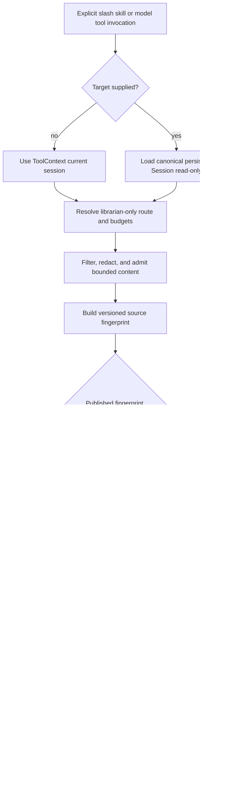

# Session Librarian Architecture

## Status and intent

The session librarian is an experimental, manually invoked, one-shot server-side workflow. It condenses the current canonical session, or one explicitly named persisted session, into a bounded and privacy-filtered artifact pair. It performs no background work, provider request, or artifact write until the user invokes the `session-librarian` skill or the corresponding model tool.

The implementation deliberately composes existing Jcode extension and runtime seams. It does not introduce another session store, protocol request, scheduler, plugin ABI, or handoff format.

## Ownership and reused seams

| Concern | Canonical owner | Reused seam |
|---|---|---|
| Stable artifact and fingerprint contracts | `jcode-session-types` | Existing dependency-light session contract crate and serde conventions |
| Persisted route and budget configuration | `jcode-config-types` | Additive, serde-defaulted `Config` records |
| Effective configuration resolution | `jcode-base::config` | Existing persisted configuration and environment loading, plus explicit invocation overrides |
| Canonical session data | `jcode-base::session::Session` | The server-owned in-memory session or `Session::load` for read-only persisted-session resolution |
| Provider construction and request execution | Existing provider registry and runtimes | A librarian-specific route is inspected and constructed without mutating the active session route |
| Orchestration, admission, generation, validation, locking, and publication | `jcode-app-core::session_librarian` | Existing server process, storage root, secret redactor, provider abstractions, and handoff normalization |
| Manual model-tool entry point | `jcode-app-core::tool::session_librarian` | Existing tool registry and `ToolContext.session_id` |
| Manual slash entry point | `.jcode/skills/session-librarian/SKILL.md` | Existing project/global skill loading and generic skill tool activation |
| Handoff projection | Existing handoff contract | `handoff_brief` and the normalized, deduplicated, maximum-32 `relevant_files` collection |

`SessionLibrarian` is a focused orchestration interface, not a public extension system. `DefaultSessionLibrarian` remains the production composition root for the existing configuration, session, provider, and storage owners.

## Invocation and data flow



The target defaults to the active `ToolContext.session_id`. An explicit identifier is resolved through existing canonical persistence without switching the active session, copying its transcript, or creating a parallel record. Concurrent duplicate tool invocations for the same target are rejected or converge through publication locking.

The orchestration order is intentionally fixed:

1. Resolve and validate independent librarian configuration.
2. Read the selected canonical `Session`.
3. Structurally filter and locally redact source content.
4. Enforce item, category, and global admission bounds.
5. Fingerprint the compact admitted representation and summary-affecting configuration.
6. Reuse an existing valid artifact pair, or acquire the fingerprint lock.
7. Make no more than one provider request within the hard deadline and cost approval.
8. Validate and normalize the response before rendering.
9. Publish both artifacts together with one directory rename.

Every terminal result is `reused`, `succeeded`, or an actionable non-secret failure. Failures before publication leave no visible partial artifact pair.

## Privacy boundary and admission stages

Privacy filtering happens locally before provider transmission. Validation and recognized-secret rejection happen again before persistence.

### Structural exclusion

The admission stage walks the canonical message/content-block structure rather than parsing terminal output. It excludes:

- hidden reasoning and reasoning traces
- Anthropic thinking and OpenAI reasoning or compaction blocks
- inline images, binary payloads, and base64-like content
- repeated startup instruction material
- complete `AGENTS.md` or equivalent instruction bodies
- complete skill bodies
- raw edit inputs and raw patches
- bulk successful tool output

User-visible text that survives structural filtering is locally passed through the existing secret redactor. Empty or fully excluded sessions fail before any provider request.

### Deterministic tool and change receipts

Tool use and result blocks are paired from already-recorded session metadata. Large reads, writes, edits, patches, and similar operations become compact deterministic receipts containing only bounded fields such as operation, normalized path, intent, status, extracted counts, input hash, result hash, and a short redacted failure excerpt when applicable. The librarian does not reread changed files.

Equivalent receipts are deduplicated. Raw successful output is represented by metadata and hashes, not copied into the provider payload. Paths are normalized and unsafe path forms are rejected or omitted at their trust boundary.

### Budget enforcement

The configurable hard defaults are:

| Limit | Default |
|---|---:|
| Admitted input | 12,000 tokens |
| Provider output | 2,500 tokens |
| Provider requests | 1 |
| Maximum approved exposure | 500,000 micros USD, or USD 0.50 |
| Deadline | 120 seconds |

Fixed local safety caps are applied before the configurable global cap:

| Local cap | Limit |
|---|---:|
| Serialized receipt | 1 KiB |
| Individual admitted item | 768 tokens |
| Normalized file content | 1,200 tokens |
| Tool category | 2,000 tokens |

Admission uses the existing provider-aware counter when available and otherwise a conservative upper bound that cannot undercount the configured limit. Category limits and the global input limit are applied deterministically. Cost is represented with integer micros rather than binary floating point. Unsupported routes, missing authentication, unknown pricing, unsafe worst-case cost, malformed responses, timeouts, and usage overruns fail explicitly.

The route and limits resolve independently of the active session. Canonical precedence is invocation override, environment override, persisted librarian configuration, then built-in default. The default route is native OpenAI OAuth with `gpt-5.6-luna` and `xhigh` effort.

## Fingerprint and idempotency

The source fingerprint algorithm is versioned as `session-librarian-fingerprint.v1`. It hashes canonical JSON containing:

- the fingerprint algorithm version
- the compact canonical admitted content, including its admission format and source session identifier
- the effective non-secret route identity
- all summary-affecting hard budgets
- the summary schema version
- the filter version
- the receipt version
- the provider prompt version

Object keys are recursively canonicalized before SHA-256 hashing. Generated timestamps and provider usage are excluded because they do not describe the source or generation contract. Raw excluded transcript material is also absent because the fingerprint is computed after filtering, redaction, receipt projection, and admission.

An equivalent admitted representation and effective configuration therefore select the same immutable directory and skip provider generation. Changed admitted content or a summary-affecting configuration/version change produces another fingerprint directory.

## Artifact contract

Successful artifacts are published beneath:

```text
~/.jcode/feedback/sessions/<session-id>/<fingerprint>/
  summary.md
  summary.json
```

Both files are rendered from the same validated `SessionSummary` value and contain matching:

- summary format version
- session identifier
- source fingerprint and fingerprint algorithm version
- generation timestamp
- effective non-secret provider, API method, model, and reasoning effort
- actual bounded input tokens, output tokens, request count, elapsed milliseconds, and cost micros USD
- structured goal, outcomes, decisions, unresolved items, and next steps
- `handoff_brief`
- normalized and deduplicated `relevant_files`

Provider output is accepted only when it is valid JSON, matches the exact structured schema without extra fields or non-normalized values, agrees with the requested session and fingerprint, stays within recorded usage limits, and contains no recognized secret. Markdown is a projection of that same value, not a separately generated provider response.

## Locking and atomic publication

Publication is coordinated per session and fingerprint beneath the existing Jcode storage root.

1. Validate the session identifier and fingerprint as safe path components.
2. If the destination directory already exists, validate both artifacts and return `reused` with zero new usage.
3. Otherwise atomically create `.<fingerprint>.lock`. A contender waits briefly for the destination and fails after the bounded lock timeout rather than generating concurrently.
4. Validate and render the complete pair in memory.
5. Create a unique hidden staging directory inside the session directory.
6. Write and sync `summary.md` and `summary.json`, then sync the staging directory.
7. Rename the staging directory to `<fingerprint>` in one filesystem operation and sync the parent directory.
8. Remove the lock on scope exit. Remove an incomplete staging directory on any pre-rename failure.

Readers therefore observe either no fingerprint directory or a complete pair. Existing immutable generations are validated before reuse. Malformed or partial destinations are reported as failures and are never silently overwritten.

## Explicit non-goals

The session librarian does not add or imply:

- automatic, scheduled, hook-driven, or background summarization
- a second transcript, session database, or copied session history
- active-session switching or mutation of its provider route
- a new cross-process protocol or SDK contract
- terminal-output parsing as a data source
- a general plugin, sidecar, or installer ABI
- raw file rereads for receipt generation
- multiple provider requests, repair retries, or unapproved cost escalation
- replacement of the existing handoff workflow or a second handoff format
- retention or publication of hidden reasoning, full instruction bodies, raw patches, images, binary blobs, base64, bulk successful output, or credentials

## Stabilization criteria

Before this experiment is treated as a stable product surface:

1. Keep artifact, configuration, and fingerprint versions explicit. Any semantic change must either preserve compatibility or increment the owning version and retain deterministic reuse behavior.
2. Maintain focused tests for manual-only invocation, canonical persisted-session resolution, every exclusion and redaction category, category/global limits, route precedence, cost preflight, schema rejection, fingerprint stability, race handling, interrupted publication, handoff normalization, and reuse.
3. Run repository guardrails, dependency-boundary checks, formatting, warnings-denied Clippy, and affected-package tests.
4. Validate the freshly built `selfdev` binary against an isolated socket. Confirm zero requests and writes while unused, one bounded attempt after invocation, complete artifacts, and unchanged active-session routing without making an unapproved live-cost request.
5. Document the supported configuration surface and failure codes before promoting it beyond experimental use.
6. Reassess upstream changes before stabilization. Prefer adapting these focused seams over adding compatibility layers or widening the architecture.

## Complete removal

The experiment is intentionally removable without migrating canonical session data or changing the single-server runtime model.

1. Remove the project/global `session-librarian` skill source.
2. Unregister and delete `jcode-app-core::tool::session_librarian`.
3. Delete `jcode-app-core::session_librarian` and its focused tests.
4. Remove the additive librarian configuration fields, environment overrides, resolver, and configuration tests from `jcode-config-types` and `jcode-base`.
5. Remove librarian-only summary, fingerprint, route, usage, and bounded relevant-file contracts from `jcode-session-types` after confirming no external consumer depends on them.
6. Remove librarian-only dependency entries or feature wiring that becomes unused. Keep shared dependencies such as `sha2` when other code still uses them.
7. Remove the librarian documentation and changelog claims.
8. Optionally delete `~/.jcode/feedback/sessions/` only with explicit user approval. These generated summaries are not canonical session state, so leaving them in place is harmless and removal of the feature does not require deleting user artifacts.
9. Run the same affected-package tests, dependency guards, formatting, Clippy, and isolated-socket smoke checks to prove normal sessions, skills, tools, providers, configuration loading, and handoff behavior are unchanged.

No protocol downgrade, database migration, session rewrite, or daemon architecture replacement is required. The small set of additive registrations and focused modules defines the full removal boundary.
